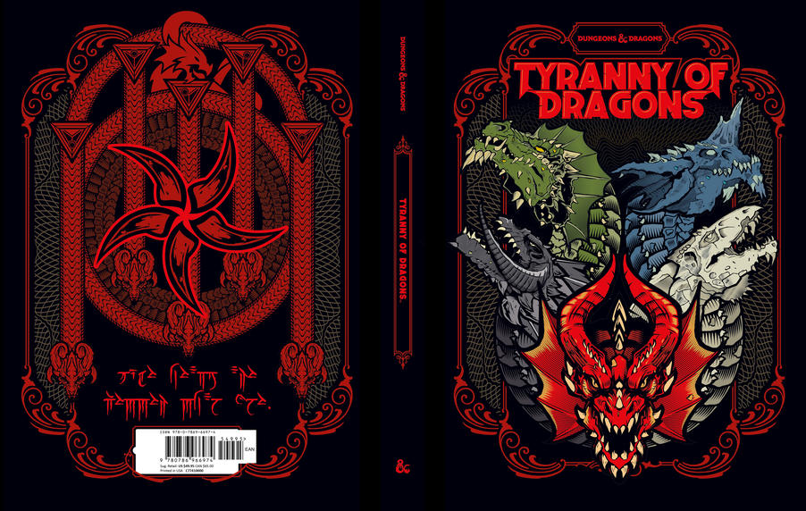

# Tyrannie des Dragons

**Traduction française complète du module D&D 5e *Tyranny of Dragons***

---

## Table des Matières

### Introduction
- [Introduction](output/00_Introduction.md)

### L'Ombre de la Reine des Dragons (Chapitres 1–8)
- [Chapitre 1 : Greenest en Flammes](output/01_Chapitre_1_Greenest_en_Flammes.md)
- [Chapitre 2 : Camp des Pillards](output/02_Chapitre_2_Camp_des_Pillardes.md)
- [Chapitre 3 : Couveuse Dragon](output/03_Chapitre_3_Couveuse_Dragon.md)
- [Chapitre 4 : Sur la Route](output/04_Chapitre_4_Sur_la_Route.md)
- [Chapitre 5 : Construction Imminente](output/05_Chapitre_5_Construction_Imminente.md)
- [Chapitre 6 : Château Naerytar](output/06_Chapitre_6_Chateau_Naerytar.md)
- [Chapitre 7 : Pavillon de Chasse](output/07_Chapitre_7_Pavillon_de_Chasse.md)
- [Chapitre 8 : Château dans les Nuages](output/08_Chapitre_8_Chateau_dans_les_Nuages.md)

### Le Soulevement de Tiamat (Chapitres 9–17)
- [Chapitre 9 : Conseil d'Eauprofonde](output/09_Chapitre_9_Conseil_d_Eauprofonde.md)
- [Chapitre 10 : Mer de Glace Changeante](output/10_Chapitre_10_Mer_de_Glace_Changeante.md)
- [Chapitres 11 et 12 : Mort des Parle-Givre](output/11_Chapitres_11_12_Mort_des_Parles-Givre.md)
- [Chapitre 13 : Le Culte Frappe](output/13_Chapitre_13_Le_Culte_Frappe.md)
- [Chapitre 14 : Dragons Métalliques, Levez-Vous](output/14_Chapitre_14_Dragons_Metalliques_Levez-Vous.md)
- [Chapitre 15 : Tour de Xonthal](output/15_Chapitre_15_Tour_de_Xonthal.md)
- [Chapitre 16 : Mission à Thay](output/16_Chapitre_16_Mission_a_Thay.md)
- [Chapitre 17 : Retour de Tiamat](output/17_Chapitre_17_Retour_de_Tiamat.md)

### Annexes
- [Annexe A : Historiques](output/18_Annexe_A_Historiques.md)
- [Annexe B : Tableau de Bord du Conseil](output/19_Annexe_B_Tableau_Conseil.md)
- [Annexe C : Objets Magiques](output/20_Annexe_C_Objets_Magiques.md)
- [Annexe D : Monstres](output/21_Annexe_D_Monstres.md)
- [Annexe E : Galerie de Concepts](output/22_Annexe_E_Galerie_Concept.md)

---

## Crédits

**Designers :** Wolfgang Baur, Steve Winter, Alexander Winter  
**D&D Lead Designers :** Mike Mearls, Jeremy Crawford  
**Traduction :** IA (o3)  
**Extraction et mise en forme :** opencode

*Ce document est une traduction non officielle réalisée à partir du PDF original. Tous les droits sur le contenu appartiennent à Wizards of the Coast LLC et Kobold Press.*
